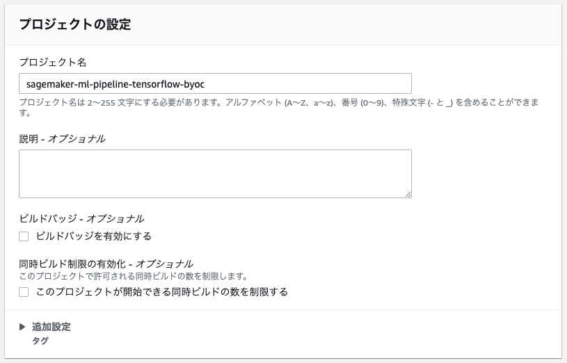
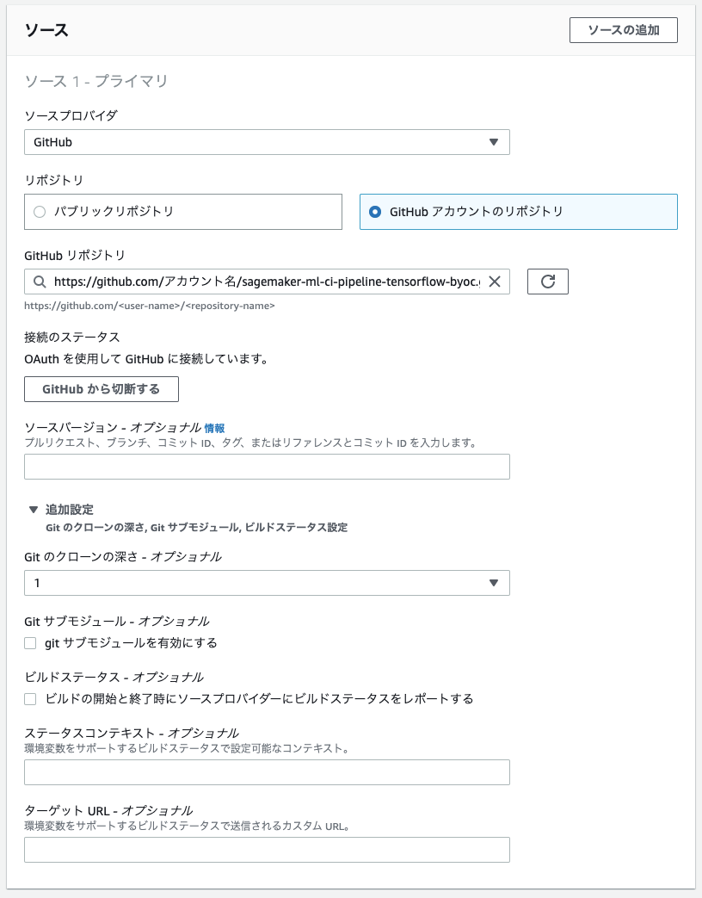
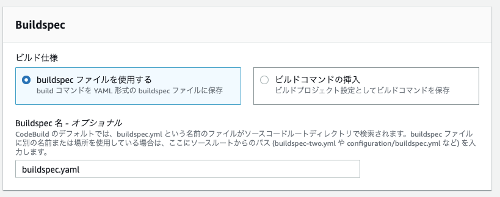

# Amazon SageMaker と AWS CodeBuild による機械学習の継続的インテグレーション BYOC編

本サンプルコードは、機械学習モデル開発へのガバナンス強化を目的に、継続的インテグレーションのビルドプロジェクトの中でモデルの学習を行うものです。

学習のための Docker イメージや、学習にまつわるパラメーターなどは `flow.yaml` に設定として定義します。機械学習ビルド中に実行するワークフローは [AWS Step Fuinctions](https://aws.amazon.com/jp/step-functions/) で定義してあり、[AWS Step Functions Data Science SDK](https://docs.aws.amazon.com/ja_jp/step-functions/latest/dg/concepts-python-sdk.html) を用いて Python で `pipeline.py` で定義してあります。ワークフロー中でのデータの前処理や学習の実行には[AWS Glue](https://aws.amazon.com/jp/glue/) [Amazon SageMaker](https://aws.amazon.com/jp/sagemaker/) を活用しています。 [AWS CodeBuild](https://aws.amazon.com/jp/codebuild/) でのビルド仕様は `buildspec.yaml` に定義してあります。

## 実行手順
### Step1. GtiHub リポジトリをフォークする
本サンプルコードは GitHub リポジトリと AWS CodeBuild を連携させてビルド中に機械学習モデルの学習を行います。このプロセスはリポジトリへのプッシュをトリガーにするため、 後ほど GitHub のアカウントと CodeBuild の接続が必要になります。その前準備として、このハンズオンの[リポジトリ](https://github.com/tkazusa/sagemaker-ml-ci-pipeline-xgboost)をフォークします。


### Step2. SageMaker notebook を作成する
Amazon SageMaker ノートブックインスタンスを立ち上げます。

- ロールを新規に作成し、任意の S3 バケットへのアクセス権限を付与する。
- `Clone a public Git repository to this notebook instance only`  を選択し、このリポジトリをクローン
- ノートブックインスタンスが ‘InService’ になるのを確認


### Step3. IAM ロールを作成する
データの前処理、学習といったステップやパイプラインの実行において AWS リソースが活用する IAM ロールを準備します。 作成するロールは Amazon SageMaker、 AWS Step Functions のための IAM ロールです。IAM ロールの作成については、[こちら](https://docs.aws.amazon.com/ja_jp/IAM/latest/UserGuide/id_roles_create.html)をご確認ください。

Amazon SageMaker へのロールに対しては `AWSStepFunctionsFullAccess`, `AmazonSageMakerFullAccess` のポリシーを付与して下さい。
AWS StepFunctions へのロールに対しては下記の手順で作成下さい。

1. [IAM console](https://console.aws.amazon.com/iam/) にアクセス
2. 左側のメニューの **ロール** を選択し **ロールの作成** をクリック
3. **ユースケースの選択** で **Step Functions** をクリック
4. **次のステップ：アクセス権限** **次のステップ：タグ** **次のステップ：確認**をクリック
5. **ロール名** に `AmazonSageMaker-StepFunctionsWorkflowExecutionRole` と入力して **ロールの作成** をクリック

次に、作成したロールに AWS マネージド IAM ポリシーをアタッチします。

1. [IAM console](https://console.aws.amazon.com/iam/) にアクセス
2. 左側のメニューの **ロール** を選択
3. 先ほど作成した `AmazonSageMaker-StepFunctionsWorkflowExecutionRole`を検索
4. **ポリシーをアタッチします** をクリックして `CloudWatchEventsFullAccess` を検索
5. `CloudWatchEventsFullAccess` の横のチェックボックスをオンにして **ポリシーのアタッチ** をクリック

次に、別の新しいポリシーをロールにアタッチします。ベストプラクティスとして、以下のステップで特定のリソースのみのアクセス権限とこのサンプルを実行するのに必要なアクションのみを有効にします。

1. 左側のメニューの **ロール** を選択
1. 先ほど作成した `AmazonSageMaker-StepFunctionsWorkflowExecutionRole`を検索
1. **ポリシーをアタッチします** をクリックして **ポリシーの作成** をクリック
1. **JSON** タブをクリックして以下の内容をペースト<br>
NOTEBOOK_ROLE_ARN の部分をノートブックインスタンスで使用している IAM ロールの ARN に置き換えてください。

```json
{
    "Version": "2012-10-17",
    "Statement": [
        {
            "Sid": "VisualEditor0",
            "Effect": "Allow",
            "Action": [
                "events:PutTargets",
                "events:DescribeRule",
                "events:PutRule"
            ],
            "Resource": [
                "arn:aws:events:*:*:rule/StepFunctionsGetEventsForSageMakerTrainingJobsRule",
                "arn:aws:events:*:*:rule/StepFunctionsGetEventsForSageMakerTransformJobsRule",
                "arn:aws:events:*:*:rule/StepFunctionsGetEventsForSageMakerTuningJobsRule",
                "arn:aws:events:*:*:rule/StepFunctionsGetEventsForECSTaskRule",
                "arn:aws:events:*:*:rule/StepFunctionsGetEventsForBatchJobsRule"
            ]
        },
        {
            "Sid": "VisualEditor1",
            "Effect": "Allow",
            "Action": "iam:PassRole",
            "Resource": "NOTEBOOK_ROLE_ARN",
            "Condition": {
                "StringEquals": {
                    "iam:PassedToService": "sagemaker.amazonaws.com"
                }
            }
        },
        {
            "Sid": "VisualEditor2",
            "Effect": "Allow",
            "Action": [
                "batch:DescribeJobs",
                "batch:SubmitJob",
                "batch:TerminateJob",
                "dynamodb:DeleteItem",
                "dynamodb:GetItem",
                "dynamodb:PutItem",
                "dynamodb:UpdateItem",
                "ecs:DescribeTasks",
                "ecs:RunTask",
                "ecs:StopTask",
                "glue:BatchStopJobRun",
                "glue:GetJobRun",
                "glue:GetJobRuns",
                "glue:StartJobRun",
                "lambda:InvokeFunction",
                "sagemaker:CreateEndpoint",
                "sagemaker:CreateEndpointConfig",
                "sagemaker:CreateHyperParameterTuningJob",
                "sagemaker:CreateModel",
                "sagemaker:CreateProcessingJob",
                "sagemaker:CreateTrainingJob",
                "sagemaker:CreateTransformJob",
                "sagemaker:DeleteEndpoint",
                "sagemaker:DeleteEndpointConfig",
                "sagemaker:DescribeHyperParameterTuningJob",
                "sagemaker:DescribeProcessingJob",
                "sagemaker:DescribeTrainingJob",
                "sagemaker:DescribeTransformJob",
                "sagemaker:ListProcessingJobs",
                "sagemaker:ListTags",
                "sagemaker:StopHyperParameterTuningJob",
                "sagemaker:StopProcessingJob",
                "sagemaker:StopTrainingJob",
                "sagemaker:StopTransformJob",
                "sagemaker:UpdateEndpoint",
                "sns:Publish",
                "sqs:SendMessage"
            ],
            "Resource": "*"
        }
    ]
}
```

5. **次のステップ：タグ** **次のステップ：確認**をクリック
6. **名前** に `AmazonSageMaker-StepFunctionsWorkflowExecutionPolicy` と入力して **ポリシーの作成** をクリック
7. 左側のメニューで **ロール** を選択して `AmazonSageMaker-StepFunctionsWorkflowExecutionRole` を検索
8. **ポリシーをアタッチします** をクリック
9. 前の手順で作成した `AmazonSageMaker-StepFunctionsWorkflowExecutionPolicy` ポリシーを検索してチェックボックスをオンにして **ポリシーのアタッチ** をクリック
11. AmazonSageMaker-StepFunctionsWorkflowExecutionRole の *Role ARN** をコピーして以下のセルにペースト
  
それぞれ作成したロールの ARN は後ほど活用するので保存しておいて下さい。
    
  
それぞれ作成したロールの ARN は後ほど活用するので保存しておいて下さい。


### Step.4 AWS CodeBuild のビルドプロジェクトを作成する

本ハンズオンでは CodeBuild でのビルド中に機械学習モデルの学習を行います。
AWS CodeBuildから、「ビルドプロジェクト」→「ビルドプロジェクトを作成する」へ進んで下さい。ビルドプロジェクトの作成画面で設定を行っていきます。

まずは、プロジェクト名を指定します。



ソースプロバイダの設定を行います。ソースプロバイダを GitHub にし、OAuth もしくはアカウントトークンを使って GitHub と接続します。


クローンしてきた GitHub リポジトリを連携するよう指定します。




ウェブフックイベントをプルリクエストの作成と更新時に設定します。


ビルド環境の設定を下記のように行います。


Buildspec は下記のように指定します。




ビルドプロジェクト作成時に作成した `codebuild-sagemaker-ci-pipeline-xgboost-service-role` へ下記のポリシーを追加します。

- `AWSStepFunctionsFullAccess`
- `AWSCodebuildDeveloperAccess`
- `AmazonS3FullAccess`
- `AWSGlueServiceRole`
    
下記インラインポリシーを作成して追加します。
```JSON
{
	"Version": "2012-10-17",
	"Statement": [
		{
			"Action": [
				"iam:PassRole"
			],
			"Effect": "Allow",
			"Resource": "*"
		}
	]
}
```


### Step.5 ビルドプロジェクトの実行
SageMaker Notebook 上からスクリプトへの変更を実行し、プルリクエストを更新することで、ビルドプロジェクトを実行します。

- SageMaker ノートブックインスタスにて JupyterLab を開きます。
- ターミナルを起動して、新しいブランチ `model-dev` を作成し、チェックアウトします。

```Bash
$ cd SageMaker/sagemaker-ml-ci-pipeline-tensorflow-byoc/
$ git checkout -b model-dev
```

`pipeline.py` 中の下記項目を設定します。

```Python
BUCKET = '<データを準備した際に保存したバケット>'
FLOW_NAME = 'flow_{}'.format(id) 
TRAINING_JOB_NAME = 'sf-train-{}'.format(id) # To avoid duplication of job name
GLUE_ROLE = '<Glue に付与するロール>'
SAGEMAKER_ROLE = '<SageMaker に付与するロール>'
WORKFLOW_ROLE ='<Step Functions に付与するロール>'
```

git 上にて変更を反映します。

```Bash
$ git add pipeline.py
$ git commit -m “mod pipeline.py”
$ git push origin HEAD
```

GitHub リポジトリ上で Pull Request を作成します。ビルドプロジェクトが成功すると下記のような表示が出ます。


